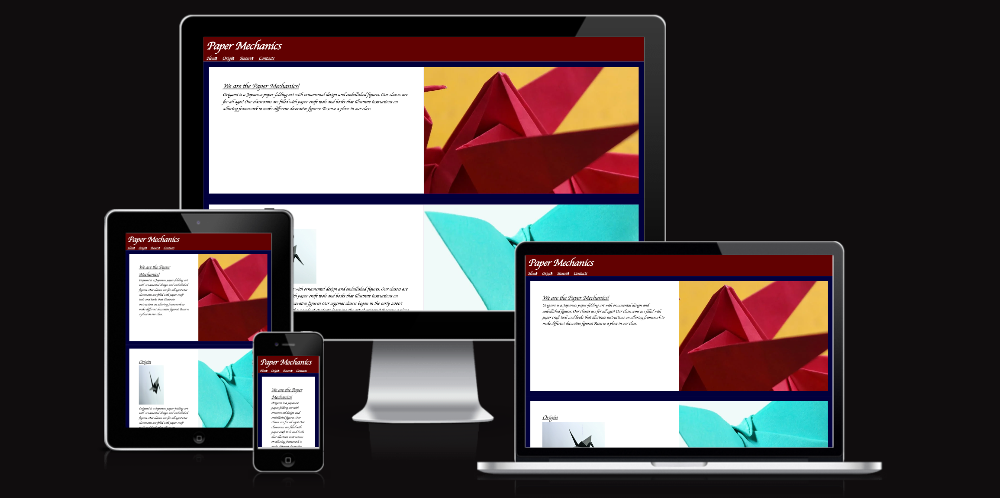
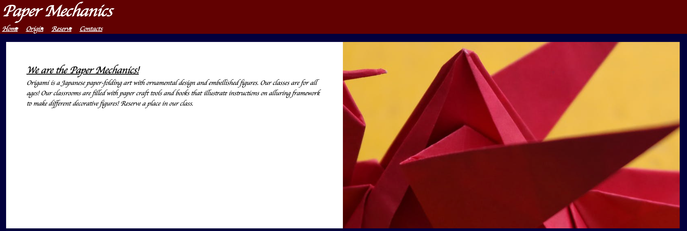
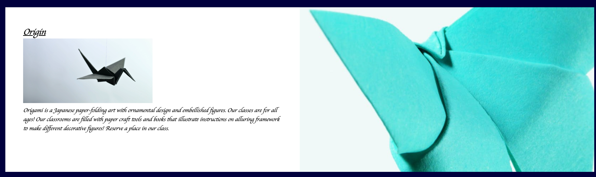
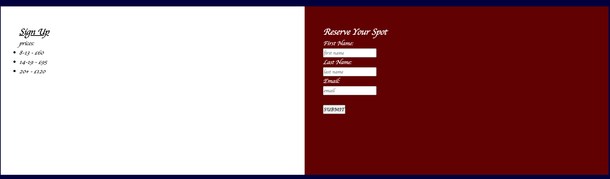
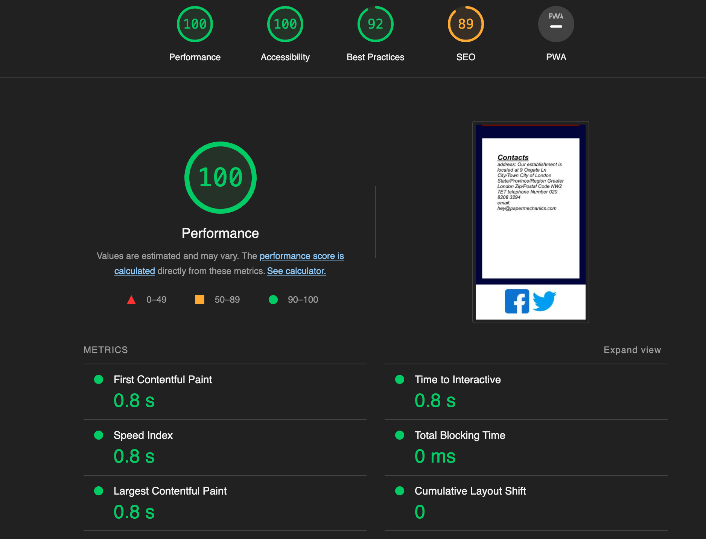

## Paper Mechanics
Welcome to my paper mechanics website!

This website features a service for a class that teaches origami. It is for all ages.

## Features

### Navigation Bar

A red navigation bar is featured on the site that contains the following links to sections on the site:

- Home
- Origin
- Reserve
- Contact

### Footer Section

The footer section contains links to social accounts (facebook and twitter). The purpose is to give the user the option to engage with the company outside the website.

### Background image
The first two sections include a background image containing origami, this connects to the theme of the website.

### Home Section

The homepage contains text to educate users about origami and tell them a little about the classes.

### Contacts Section

The contacts page includes information for the user to reach out to/find the company such as the location and the company email

### Origin Section

This page displays information about the origami classes and its founding date.

### Reserve/Register Section

This page will allow the user to submit their information in order to enquire about the origami classes. The prices for the classes are displayed on the left side (desktop view) allowing users to have more information before booking. 

## Testing 

### Validator Testing 

- HTML
  - No errors were returned when passing through the official [W3C validator](https://validator.w3.org/nu/)
- CSS
  - No errors were found when passing through the official [(Jigsaw) validator](https://jigsaw.w3.org/css-validator/validator)
- Screen compatibility 
    - I have tested the screen layout of the website, on the 'am i responsive' website.( https://ui.dev/amiresponsive)
- Performance
    - The site performace was tested on lighthouse and received a score of 84.[website](). 
    

### Encountered Bugs (Fixed/Resolved)
I had trouble showing a background image embedded in the body element inall the webpages. The issue has not been resolved. When insued the the W3C CSS validator it pointed out that there is no code to link the html documents to the CSS stylesheet. Then, the issue was resolved.

## Deployment procedure
The application is deployed by configuring the github repository to use the main branch for a github pages site. Each commit to the main branch will update the site url.

## Credits

### Images
The images were found on [google](https://google.com) and pexels.com

